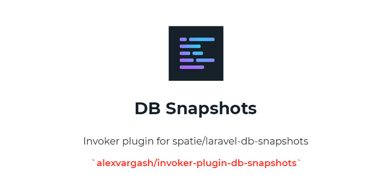

# Invoker Plugin Db Snapshots



Plugin that allows you to create, delete and load database snapshots. This plugin requires [spatie/laravel-db-snapshots](https://github.com/spatie/laravel-db-snapshots) package to be installed in the Laravel application.

## Global Installation

Clone the repository on your local machine.

```bash
git clone git@github.com:alexvargash/invoker-plugin-db-snapshots.git
```

Install the npm dependencies.

```bash
npm install
```

Create the plugin zip file.

```bash
npm run build-plugin
```

Load the plugin from the plugins section on Invoker and select the generated zip file.

## Local Installation

Create a folder on the root of your Laravel application `invoker/plugins/db-snapshots` and clone the repository into that folder.

```bash
git clone git@github.com:alexvargash/invoker-plugin-db-snapshots.git
```

Install the npm dependencies.

```bash
npm install
```

Generate the production files.

```bash
npm run prod
```

## Important

The `spatie/laravel-db-snapshots` package uses mysqldump, you need to specify on the `config/database.php` config file the route of the `mysqldump` binary.

```php
'mysql' => [
    'driver' => 'mysql',
    'url' => env('DATABASE_URL'),
    'host' => env('DB_HOST', '127.0.0.1'),
    'port' => env('DB_PORT', '3306'),
    'database' => env('DB_DATABASE', 'forge'),
    'username' => env('DB_USERNAME', 'forge'),
    'password' => env('DB_PASSWORD', ''),
    'unix_socket' => env('DB_SOCKET', ''),
    'charset' => 'utf8mb4',
    'collation' => 'utf8mb4_unicode_ci',
    'prefix' => '',
    'prefix_indexes' => true,
    'strict' => true,
    'engine' => null,
    'options' => extension_loaded('pdo_mysql') ? array_filter([
        PDO::MYSQL_ATTR_SSL_CA => env('MYSQL_ATTR_SSL_CA'),
    ]) : [],
    'dump' => [ 'dump_binary_path' => '/usr/local/bin/' ] // <----- This line
],
```

## Roadmap

- Add name for a new Snapshot.
- Add compression option when creating a new Snapshot.
- Add keep option when cleaning up Snapshots.

## Contributing
Pull requests are welcome. For major changes, please open an issue first to discuss what you would like to change.

## License
[MIT](./LICENSE.md)
